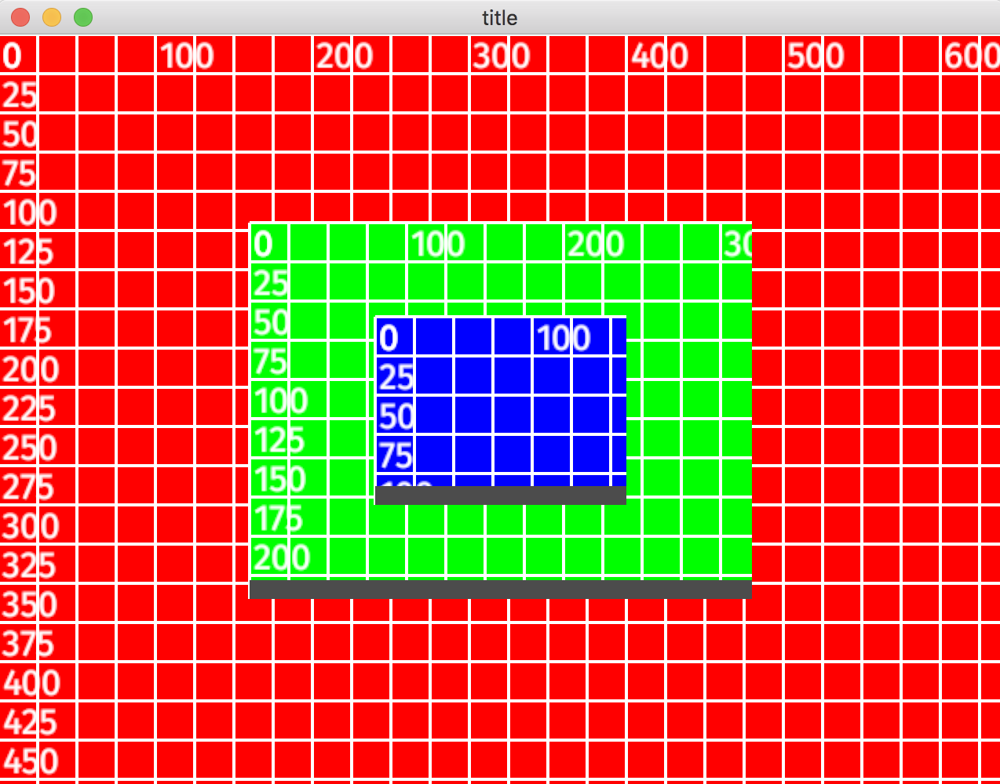

# rsui

## Description

A cross platform UI toolkit based on Piston.

Pronounced "are-sue-we".

## Principles

- Simplicity
- Mutual benefit
- Baby steps

## Goals

- Cross-platform (Windows, Mac, Linux)
- Simple looking UI ("old school")
- Simple to write useful applications in
- Zero install apps (static linked dependencies)

## Anti-goals

- Rounded corners
- Drop shadows
- Non-rectangular widgets
- CSS-like layout languages
- Native look and feel
- Re-creating the browser

## Current Screenshot

## Done

- [x] Basic Widget interface
- [x] Nested transforms and clipping
- [x] Rendering

## TODO

- [ ] Invalidation
- [ ] Scroll bars
- [ ] Events
- [ ] Event capturing 
- [ ] Focus
- [ ] Copy and paste
- [ ] TextBox
- [ ] Menu
- [ ] FilePicker

